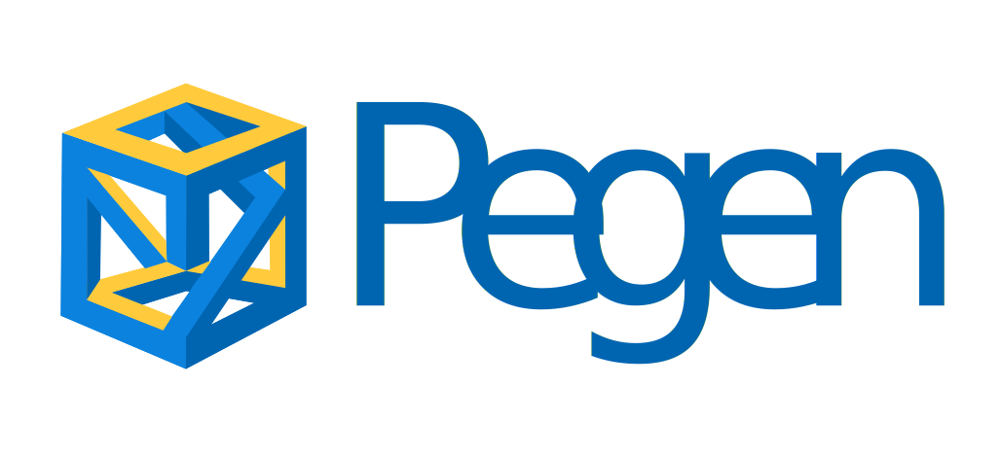

.. pegen documentation master file, created by
   sphinx-quickstart on Tue Sep 28 13:01:24 2021.
   You can adapt this file completely to your liking, but it should at least
   contain the root `toctree` directive.

What is this?
=============

Pegen is the parser generator used in CPython to produce the parser used
by the interpreter. It allows to produce PEG parsers from a description
of a formal Grammar.

Installing
==========

Install with ``pip`` or your favorite PyPi package manager.

.. code-block::

   pip install pegen

How to generate a parser
========================

Given a grammar file compatible with ``pegen`` (you can write your own
or start with one in the `data <https://github.com/we-like-parsers/pegen/tree/main/data>`__ directory), you can easily
generate a parser by running:

.. code-block::

   python -m pegen <path-to-grammar-file> -o parser.py

This will generate a file called ``parser.py`` in the current directory.
This can be used to parse code using the grammar that we just used:

.. code-block::

   python parser.py <file-with-code-to-parse>

Differences with CPython’s Pegen
================================

This repository exists to distribute a version of the Python PEG parser
generator used by CPython that can be installed via PyPI, with some
improvements. Although the official PEG generator included in CPython
can generate both Python and C code, this distribution of the generator
only allows to generate Python code. This is due to the fact that the C
code generated by the generator included in CPython includes a lot of
implementation details and private headers that are not available for
general usage.

The official PEG generator for Python 3.9 and later is now included in
the CPython repo under
`Tools/peg_generator/ <https://github.com/python/cpython/tree/master/Tools/peg_generator>`__.

See also `PEP 617 <https://www.python.org/dev/peps/pep-0617/>`__.

Indices and tables
==================

.. toctree::

   peg_parsers
   grammar

* :ref:`genindex`
* :ref:`modindex`
* :ref:`search`

Developing
----------

We welcome contributions to ``pegen``. Check
`CONTRIBUTING.md <https://github.com/we-like-parsers/pegen/blob/main/CONTRIBUTING.md>`__
to get an idea of how to contribute to the project.
